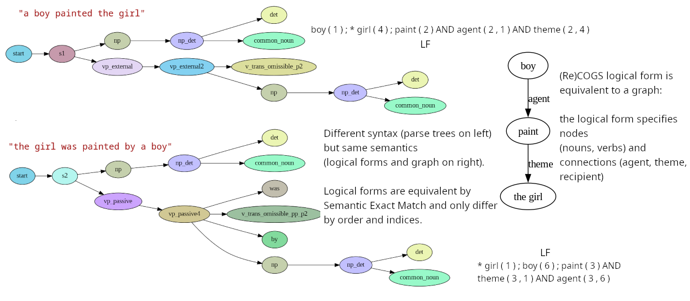

Solving little problems in Restricted Access Sequence Processing (RASP), a language designed to help one in "Thinking Like Transformers" (title of Weiss et al 2021 paper, https://arxiv.org/abs/2106.06981 ,  which introduced it). 

Used RASP for a final project in Stanford XCS224U class this year to solve ReCOGS_pos ( https://digitalcredential.stanford.edu/check/24288227F20DD8486799B5FF5E8C04CB440129EC0DE44FEB65C4BAFABDBAA68BQWtzR2p1TG45dHowNWg5dXp6UW1kNmdYVVExekNJa1V3R2J5aFdhWi9Lb01MakFZ ) so was trying to keep myself accountable by working through problems in a repo along the way. 

Sharing some of the RASP-for-ReCOGS_pos project as well here (mostly in private repo and notebooks with a paper).

Programs in this folder can be interpreted using Weiss et al 2021's RASP interpreter at https://github.com/tech-srl/RASP .

## RASP-for-ReCOGS_pos ( recogs_examples_in_rasp.py and word-level-pos-tokens-recogs-style-decoder-loop.rasp )

**Update: There is an associated unpublished research paper which is in early stages at https://raw.githubusercontent.com/willy-b/RASP-for-ReCOGS/main/rasp-for-recogs_pos-wbruns-2024-draft.pdf .**

**Copies of evaluation results notebooks and a comparison with Wu et al 2023 Transformer baselines trained from scratch are also checked in at https://github.com/willy-b/RASP-for-ReCOGS/tree/main/supplemental_data#analysis-and-evaluation-notebooks .**

This section describes a RASP model under development to perform the ReCOGS_pos task (see Wu et al 2023, "ReCOGS: How Incidental Details of a Logical Form Overshadow an Evaluation of Semantic Interpretation", https://arxiv.org/abs/2303.13716 for task description) to try to prove-by-construction that a Transformer can learn it in a compositional, systematic, length generalizing way and try to understand why some errors are observed.

You can run a demo and see the autoregressive output on the training set

(or just visit e.g. https://colab.research.google.com/drive/1q-24YGWYX2zo7N50q69Y8jg5Kcb_0ph4?usp=sharing for a full dev set evaluation )

```
git clone https://github.com/willy-b/learning-rasp.git
cd learning-rasp
python recogs_examples_in_rasp.py # runs only 5 examples on training set by default, you can run more examples or evaluate on dev/test/gen by using commandline arguments (see file)
```

The script will show performance on Wu et al 2023 ReCOGS_pos training data by default, run with "--use_dev_split", "--use_gen_split" , or "--use_test_split" to see it run on those and give a running score every row.



For ReCOGS, intending to perform well on Semantic Exact Match, we took a simple, flat, non-tree, non-recursive (except for decoder loop) approach which was able to get 100% on the full test set first try: https://colab.research.google.com/drive/1N7F-nc9GVnoC_9dBVdNT02SBiBcMbgy-?usp=sharing .

We also report String Exact Match since https://github.com/willy-b/learning-rasp/pull/7 (Semantic Exact Match is more forgiving, ignoring reorderings of the logical form that do not change the semantics).

We took the RASP native sequence tokens, and first did a Transformer learned-embedding compatible operation and created 1 part-of-speech and 4 extra verb-type sequences (because each word in the COGS vocabulary may actually serve multiple POS roles; up to four different verb types as in the case of "liked" 

which can serve as v_trans_not_omissible, v_trans_not_omissible_pp_p1, v_trans_not_omissible_pp_p2, and v_cp_taking types). 

The five extra sequences serve to associate each word with one or more of the following part-of-speech/verb type roles:
```
det: 1
pp: 2
was: 3
by: 4
to: 5
that: 6
common_noun: 7
proper_noun: 8
v_trans_omissible: 9
v_trans_omissible_pp: 10
v_trans_not_omissible: 11
v_trans_not_omissible_pp: 12
v_cp_taking: 13
v_inf_taking: 14
v_unacc: 15
v_unerg: 16
v_inf: 17
v_dat: 18
v_dat_pp: 19
v_unacc_pp: 20
```

Each of the five sequences comes from a separate map. Since in RASP modeling a Transformer, a map could only have a single value per key, and since individual words had up to four different verb roles (as in "liked" which had 4).

Upon these five parallel, aligned, sequences we used a series of attention head compatible operations to recognize multi-token patterns corresponding to 19 grammatical forms to cover the input grammar.

To justify this approach, we can, given the COGS input sentences were generated as a probablistic context free grammar per (Kim and Linzen 2020, https://aclanthology.org/2020.emnlp-main.731 )
use the full details put in Lark format by ( Klinger et al 2024 , https://arxiv.org/abs/2309.16467 just their utilities , not their model )
and convert it ourselves to a format compatible with ( Zeller et al 2023, https://www.fuzzingbook.org/html/GrammarCoverageFuzzer.html ) and use their TrackingGrammarCoverageFuzzer to generate the set of all expansions of the COGS grammar. 

Note that grammar coverage lets us consider after each training example what could possibly have been learned about the grammar.
For example, we can use this to see that by 55 examples of the ReCOGS training set (unshuffled, no augmentations) or 77 (median; 95% confidence interval, n=1000 random shuffles: 39 to 161) examples of the ReCOGS training set (shuffled, no augmentations), 100% grammar coverage is reached (lexical differences ignored) (we treat all words within a POS identically) (for description of grammer coverage see Zeller et al 2023, https://www.fuzzingbook.org/html/GrammarCoverageFuzzer.html ) (noting that if the model is not capable of learning certain expansions in the grammar such as `np_det pp np -> np_pp -> np`, as is actually true for our RASP model and we hypothesis for the Wu et al 2023 baseline Transformer it will need to see more variations to memorize individual cases instead):


This confirms that if one already knows parts of speech and verb types for words one needs much less data (note this is consistent with large pretrained Transformer language models being observed to have learned to represent part of speech at the earliest layers, (Tenney et al 2019, "BERT Rediscovers the Classical NLP Pipeline", https://arxiv.org/abs/1905.05950 ).

Thus, we can be more efficient than using the ReCOGS training set for our RASP model built by hand since we our solution uses a manual embedding via a dictionary mapping words to part-of-speech and verb-type, that ensures all words within a part of speech are treated identically (in real world learned embeddings/pretraining or a GloVe embedding would be used to solve this step; again (Tenney et al 2019, https://arxiv.org/abs/1905.05950 ) confirm BERT, a pre-trained Transformer model in wide use, has part-of-speech information available at the earliest layers.).

We generated 21 sentences which cover 100\% of the COGS input grammar ( Zeller et al 2023, https://www.fuzzingbook.org/html/GrammarCoverageFuzzer.html ) under those constraints (under the context free grammar, tree based assumption which turns out to be incorrect just for prepositional phrases):

(note that if the prepositional phrase and complement phrase cases were added into one or two of 19 base grammar form examples only 19 total examples are actually needed, but we keep the recursive grammar parts separated for clarity here)

```
"the girl was painted", 
"a boy painted",
"a boy painted the girl",
"the girl was painted by a boy",
"a boy respected the girl", 
"the girl was respected",
"the girl was respected by a boy",
"the boy grew the flower",
"the flower was grown",
"the flower was grown by a boy",
"the scientist wanted to read",
"the guest smiled",
"the flower grew",
"ella sold a car to the customer",
"ella sold a customer a car",
"the customer was sold a car",
"the customer was sold a car by ella",
"the car was sold to the customer by ella",
"the car was sold to the customer",

"a boy painted the girl in a house"
"the girl noticed that a boy painted the girl"
```

The first 19 of those sentences are present in our RASP program code ( https://github.com/willy-b/learning-rasp/blob/
dca0bc6689b0454b75e5a46e77ffe66566ca7661/word-level-pos-tokens-recogs-style-decoder-loop.rasp\#L568 ) as canonical examples of verb type templates.
For each of these sentences we add a group of RASP operations corresponding to attention operations in a Transformer to match a template corresponding to that sentence type. 

Those 19 examples reflect the only rules for handling non-prepositional grammar rules. 

To handle prepositional phrases in a flat solution, we find it necessary even on the training data to add a rule that ignores noun phrases preceded by a prepositonal phrase (ignore "pp np") when searching for noun indexes to report in relationships (agent, theme, recipient, etc), and we loosen verb type templates to allow a gap for any prepositional phrase to be inserted (this was not done in every possible case manually within the original 2 week project work period which is why we did not get 100% in that one split, see paper results section). We shall see encountering this issue in RASP and the grammar analysis suggesting a non-tree solution is learned by the Transformer appears to lead us to be able to predict 100% of a certain category of errors a baseline Wu et al 2023 ( https://arxiv.org/abs/2303.13716 ) Encoder-Decoder Transformer makes for most model instances (96% of errors overall) present in our RASP solution before adding the rule to ignore "pp np" (based on training examples but biased to learn it generally) (the RASP model got 100% on the ReCOGS_pos test set first try, see https://colab.research.google.com/drive/1N7F-nc9GVnoC_9dBVdNT02SBiBcMbgy-?usp=sharing , though you can use the python script in this folder to run that test yourself as well).


Here is an example of a template for one of these sentences:
```
np_det_mask = select(7, pos_tokens, ==) 
and select(pos_tokens, 1, ==) 
and select(indices+1, indices, ==);
np_prop_mask = select(8, pos_tokens, ==) and 
select(indices, indices, ==);
np_det_sequence = aggregate(np_det_mask, 1);
np_prop_sequence = aggregate(np_prop_mask, 1);
np_det_after = select(np_det_sequence, 1, ==) and 
select(indices+1, indices, ==);
np_prop_after = select(np_prop_sequence, 1, ==) and 
select(indices+1, indices, ==);
np_after_mask = np_det_after or np_prop_after;
np_after_sequence = aggregate(np_after_mask, 1);
np_after_mask = select(np_after_sequence, 1, ==) and 
select(indices,indices, ==);
# ...

# np v_unerg
# e.g. [1,7,16]
set example ["the", "guest", "smiled"]
v_unerg_mask = select(16, pos_tokens_vmap1, ==) and 
select(indices, indices, ==);
np_v_unerg = aggregate(np_after_mask and v_unerg_mask, 1);
```

**These patterns are not causal because their use/input/output is masked to the input section of the sequence, so would take part in the Encoder of the Encoder-Decoder only**(**all operations outside the input mask in the word-level token RASP solution used in this paper are directly or indirectly causally masked** and we built symbol by symbol in a causal autoregressive way). **We could have added an explicit causal mask to each operation but for efficiency and simplicity of the code omitted it when we are doing it implicitly by taking only the last sequence position (we also acausally aggregate so that all sequence positions have the same value as the last sequence position to make it easier to read the output -- RASP interpreter will just print it as one position if they are all equal and we only take one position).**

Also, the author thinks many of these RASP steps could be consolidated. The goal here was to first prove by construction that a non-recursive, flat RASP program could get approximately 100% Semantic Exact Match on all the ReCOGS generalization splits (we only missed one split by a little due to two week time constraint, insufficient time to add all prepositional phrase handling rules).

Introduction of variables at the beginning of the ReCOGS logical form (e.g. in the logical form for "a boy painted the girl", we have "boy ( 1 ) ; * girl ( 4 ) ; paint ( 2 ) AND agent ( 2 , 1 ) AND theme ( 2 , 4 )" , the variable introduction is "boy ( 1 ) ; * girl ( 4 ) ; paint ( 2 )" before the "AND"). A more complete solution that handles not just prepositional phrase recursion (we score approximately 100% with the solution we are describing here). In the description here we ignore complement phrases (see code for those details) and simplify and just sort the input sequence with nouns before verbs and determiners, fillers last (with determiners and fillers not having any corresponding entry in the output sequence). We then count nouns and verbs in the input and count nouns and verbs in the output and determine if we have introduced all the nouns and verbs.

Example counting how many nouns and verbs we have output (introduced as variables) so far (to determine what we need to output for next token):
```
nv_in_output_sequence = 
OUTPUT_MASK*(indicator(pos_tokens == 7 or pos_tokens == 8) + 
indicator(pos_tokens_vmap1 == 9 or pos_tokens_vmap2 == 10 or 
pos_tokens_vmap1 == 11 or pos_tokens_vmap2 == 12 or pos_tokens_vmap3 == 13 or 
pos_tokens_vmap4 == 14 or pos_tokens_vmap1 == 15 or pos_tokens_vmap1 == 16 or 
pos_tokens_vmap1 == 17 or pos_tokens_vmap1 == 18 or pos_tokens_vmap2 == 19 or 
pos_tokens_vmap2 == 20 or pos_tokens_vmap1==21));
nv_in_output_count = selector_width(select(nv_in_output_sequence, 1, ==)); 
# causal operation as we use only last sequence position
```

How variables are introduced with their index (omitted sorting of input and other operations that can be read in the code and are less important; anything acausal is restricted to input sequence section (Encoder)):
(only value at last sequence position is used; causal)
```
# introducing variables
output = "";
# definite article word handling
before_target_word_index = aggregate(select(indices, nv_in_output_count, ==), input_indices_sorted)-1;
has_star = aggregate(select(indices, before_target_word_index, ==), tokens) == "the";
last_output_is_star = aggregate(select(indices, length-1, ==), tokens) == "*";

input_nv_sorted_by_type = input_tokens_sorted_by_type * (input_noun_mask_sorted + input_verb_mask_sorted);
target_word_token = aggregate(select(indices, nv_in_output_count, ==), normalize_nv(input_nv_sorted_by_type)) 
if (not has_star or last_output_is_star) else "*";
# subtract 1 when matching for producing the index because we just output the additional word by then
target_word_index = aggregate(select(indices, nv_in_output_count-1, ==), input_indices_sorted);

output = target_word_token if ((num_tokens_in_output_excluding_asterisks % 5) == 0) else output;
output = "(" if ((num_tokens_in_output_excluding_asterisks % 5) == 1) else output;
output = target_word_index if ((num_tokens_in_output_excluding_asterisks % 5) == 2) else output;
output = ")" if ((num_tokens_in_output_excluding_asterisks % 5) == 3) else output;
# note that when nv_in_output_count == nv_in_input_count, we will add AND instead of ";"
output = (";" if (5 * nv_in_input_count - 1 > num_tokens_in_output_excluding_asterisks) else "AND") 
if (num_tokens_in_output_excluding_asterisks % 5 == 4) else output;

# if we didn't have an input/output separator that needs to be output
output = "|" if num_pipes_in_output == 0 else output;
```

Note that "normalize_nv" is a lookup into a map that has no effect unless the word is a verb in which case it normalizes it to a standard suffix ("ate" to "eat" , "painted" to "paint", etc).

As you can see above, if we have not introduced all the variables, we determine our index into the sorted list of nouns and verbs (nouns before verbs), and using a MLP modeling modulus, compute index mod 5 and condition on that to output that noun/verb or parentheses or index as prediction for next token at last sequence position (all other sequence positions are ignored). Since we do ReCOGS_pos (semantically identical to random indices but avoid requiring random numbers) the index we use is the index of the original noun or verb in the original sequence. If we are still introducing variables, that is the end and we have our prediction for the next token.

If we are done introducing variables at that point in the decoder loop, we move on, 
and attention head compatible operations recognize templates in the five parallel part-of-speech / verb-type per location sequences for "v_trans_omissible_p1", "v_trans_omissible_p2", "v_trans_omissible_pp_p1", "v_trans_omissible_pp_p2", "v_trans_not_omissible", "v_trans_not_omissible_pp_p1", "v_trans_not_omissible_pp_p2", "v_cp_taking", "v_inf_taking", "v_unacc_p1", "v_unacc_p2", "v_unacc_pp_p1", "v_unacc_pp_p2", "v_unerg", "v_dat_p2", "v_dat_pp_p1", "v_dat_pp_p2",  "v_dat_pp_p3",  "v_dat_pp_p4".

Here are a couple of examples of patterns, to see how it looks if we support 1 verb pattern per input (no complement phrase recursion; which can be easily handled how we handle other things we loop over, looping over current phrase and masking and processing, see actual code for details), which is sufficient to get approximately 100\% on all entries that do not use complement phrases (e.g. "so-and-so noticed that (full input here)"):
(update: complement phrases are supported in the .rasp file)

```
# define the pattern
# ... (just showing one example, np_prop_mask and np_before_mask are attention masks defined earlier)
# np v_dat_p2 np np
# e.g. [8,18,1,7,1,7]
set example ["ella","sold","a","customer","a","car"]
np_np_sequence = aggregate((np_prop_mask and np_before_mask) or (np_det_left_mask and np_two_before_mask), 1);
# would not support prepositional phrase modification on middle NP
#np_np_before_mask = select(np_np_sequence, 1, ==) and select(indices-1, indices, ==);
np_np_any_before_mask = select(np_np_sequence, 1, ==) and select(indices, indices, >); # acausal is ok in INPUT sequence (encoder part, not decoder), would mask further if we wanted to do multiple templates per input or something outside the supported grammar (COGS without complement phrase recursion is supported here)
np_np_any_before_sequence = aggregate(np_np_any_before_mask, 1);
np_np_any_before_mask = select(np_np_any_before_sequence, 1, ==) and select(indices, indices, ==);
np_v_dat_p_np_np = aggregate(np_after_mask and v_dat_mask and np_before_mask and np_np_any_before_mask, 1);
# Example: np_v_dat_p_np_np(['ella', 'sold', 'a', 'customer', 'a', 'car']) = [0, 1, 0, 0, 0, 0] (ints)
# Example: np_v_dat_p_np_np([8, 18, 1, 7, 1, 7]) = [0, 1, 0, 0, 0, 0] (ints)

# ...

# check the pattern and set the template name
any_np_v_trans_omissible = aggregate(select(np_v_trans_omissible, 1, ==), 1);
template_name = "v_trans_omissible_p1" 
if (any_np_v_trans_omissible == 1) else template_name;

# ...

any_v_dat_p2 = aggregate(select(np_v_dat_p_np_np, 1, ==), 1);
template_name = "v_dat_p2" if (any_v_dat_p2 == 1) else template_name;

# ...

any_v_dat_pp_p4 = aggregate(select(np_was_v_dat_pp_np_by_np, 1, ==), 1);
template_name = "v_dat_pp_p4" if (any_v_dat_pp_p4 == 1) else template_name;

# must be checked after P4
any_v_dat_pp_p2 = aggregate(select(np_was_v_dat_pp_to_np_by_np, 1, ==), 1);
template_name = "v_dat_pp_p2" if (any_v_dat_pp_p2 == 1) else template_name;

# template name is used to lookup the number of verb relationships to output and what they are for each index e.g. ["theme", "agent"] vs. ["agent", "recipient", "theme"] etc
```

The rest of this applies to just values used from the last sequence location (output is prediction for next symbol).

Based on the template recognized, we lookup the template size for number of relationships (theme, recipient, agent) for that verb type:
```
def template_size(template_name) {
  template_sizes = {
 "": 0,
 "v_trans_omissible_p1": 1,
 "v_trans_omissible_p2": 2,
 "v_trans_omissible_pp_p1": 1,
 "v_trans_omissible_pp_p2": 2,
 "v_trans_not_omissible": 2,
 "v_trans_not_omissible_pp_p1": 1,
 "v_trans_not_omissible_pp_p2": 2,
 "v_cp_taking": 2,
 "v_inf_taking": 4,
 "v_unacc_p1": 2,
 "v_unacc_p2": 1,
 "v_unacc_pp_p1": 1,
 "v_unacc_pp_p2": 2,
 "v_unerg": 1,
# "v_inf": 1,
 "v_dat_p1": 3,
 "v_dat_p2": 3,
 "v_dat_pp_p1": 2,
 "v_dat_pp_p2": 3,
 "v_dat_pp_p3": 2,
 "v_dat_pp_p4": 3 
  };
  # v_inf_taking includes v_inf and an extra verb is why it is 4 instead of 2
  return template_sizes[template_name];
}
```

Details are in the code, but we compute at the last sequence position (in parallel) the number of relationships output for the verb so far, and for the current relationship which token within that multi-token process (e.g. the word "agent" or the open parenthesis "(" or the left index, or the comma, or right index, close parenthesis ")", "AND", etc) we are on.

Like we computed at the last sequence position the number of nouns and verbs in the output once we are finished introducing nouns and verbs (this is a little different in the actual code with complement phrases, see the actual .rasp file code for details), we compute the number of agent,theme,recipient,xcomp,ccomp entries in the output:

```
atrxc_in_output_sequence = OUTPUT_MASK*(indicator(tokens == "agent" 
or tokens == "theme" 
or tokens=="recipient" 
or tokens=="xcomp" or tokens =="ccomp"));
# agent_theme_recipient_xcomp_ccomp_output_count is the number of relationships we have output
agent_theme_recipient_xcomp_ccomp_output_count = 
selector_width(select(atrxc_in_output_sequence, 1, ==));
after_intro_idx = 
(nv_in_output_count - nv_in_input_count + agent_theme_recipient_xcomp_ccomp_output_count) if nv_in_output_count >= nv_in_input_count else 0;
after_intro_num_tokens_in_output_excluding_asterisks = 
num_tokens_in_output_excluding_asterisks - ((5 * nv_in_input_count));
```

We use all those different values which are computed independently from the input sequence and so do not add depth/layer requirements as many of the ones which involve accessing the sequence can be done in parallel. 
We then use the verb-type and relationship index to the relationship into a map to get the current relationship to output (as some verb types output agent first, some output theme, etc):

```
template_mapping1 = {
 "": "",
 "v_trans_omissible_p1": "agent",
 "v_trans_omissible_p2": "agent",
 "v_trans_omissible_pp_p1": "theme",
 "v_trans_omissible_pp_p2": "theme",
 "v_trans_not_omissible": "agent",
 "v_trans_not_omissible_pp_p1": "theme",
 "v_trans_not_omissible_pp_p2": "theme",
 "v_cp_taking": "agent",
 "v_inf_taking": "agent",
 "v_unacc_p1": "agent",
 "v_unacc_p2": "theme",
 "v_unacc_pp_p1": "theme",
 "v_unacc_pp_p2": "theme",
 "v_unerg": "agent",
 "v_inf": "agent",
 "v_dat_p1": "agent",
 "v_dat_p2": "agent",
 "v_dat_pp_p1": "theme",
 "v_dat_pp_p2": "theme",
 "v_dat_pp_p3": "recipient",
 "v_dat_pp_p4": "recipient"
};
```

Outputting the verb relationships we must skip over any "pp np" as possible agents, themes, or recipients to avoid getting confused by noun phrases added by prepositional modification (believed by the author to be the cause of the issue with obj pp to subj pp generalization by (Wu et al 2023 https://arxiv.org/abs/2303.13716 )'s Transformer).

```
pp_sequence = indicator(pos_tokens == 2);
pp_one_after_mask = select(pp_sequence, 1, ==) and select(indices+1, indices, ==);
pp_one_after_sequence = aggregate(pp_one_after_mask, 1);
pp_one_after_mask = select(pp_one_after_sequence, 1, ==) and select(indices, indices, ==);

pp_two_after_mask = select(pp_sequence, 1, ==) and select(indices+2, indices, ==);
pp_two_after_sequence = aggregate(pp_two_after_mask, 1);
pp_two_after_mask = select(pp_two_after_sequence, 1, ==) and select(indices, indices, ==);

np_det_diag_mask = select(aggregate(np_det_mask, 1), 1, ==) and select(indices, indices, ==);
np_prop_diag_mask = select(aggregate(np_prop_mask, 1), 1, ==) and select(indices, indices, ==);

no_pp_np_mask = 
1 - aggregate((pp_one_after_mask and np_prop_diag_mask) or 
(pp_two_after_mask and np_det_diag_mask), 1);
nps_without_pp_prefix_indices = selector_width(select(NOUN_MASK*no_pp_np_mask, 1, ==) and select(indices, indices, <=))*NOUN_MASK*no_pp_np_mask;

left_idx = aggregate(select(indices, left_idx_in_nps_zero_based, ==), input_indices_sorted);
right_idx = aggregate(select(nps_without_pp_prefix_indices, after_intro_idx, ==), indices);

# points to 2nd verb for xcomp for v_inf_taking_v_inf
right_idx = aggregate(select(indices, (nv_in_output_count-1), ==), input_indices_sorted) 
if (template_name == "v_inf_taking" and after_intro_idx == 2) else right_idx;

# points to 1st noun for 2nd v_inf agent in v_inf_taking_v_inf
right_idx = aggregate(select(indices, 0, ==), input_indices_sorted) 
if (template_name == "v_inf_taking" and after_intro_idx == 3) else right_idx;

# ...

after_intro_target_token = left_idx 
if (after_intro_num_tokens_in_output_excluding_asterisks % 7 == 2) else after_intro_target_token;

after_intro_target_token = "," 
if (after_intro_num_tokens_in_output_excluding_asterisks % 7 == 3) else after_intro_target_token;

after_intro_target_token = right_idx 
if (after_intro_num_tokens_in_output_excluding_asterisks % 7 == 4) 
else after_intro_target_token;

after_intro_target_token = ")" 
if (after_intro_num_tokens_in_output_excluding_asterisks % 7 == 5) 
else after_intro_target_token;

after_intro_target_token = "AND" 
if (after_intro_num_tokens_in_output_excluding_asterisks % 7 == 6 
and not (template_mapping_output == "")) else after_intro_target_token;

# ...
```
After outputting all verb relationships, we consider whether we have prepositional phrase noun modifiers to record in the logical form.

For outputting prepositional relationships ("nmod . in", "nmod . on", "nmod . beside"), we do a similar approach, counting prepositional phrases in the input, counting how many nmods we have output, figuring out which one is currently being output:

```
pps_in_input_sequence = INPUT_MASK*(indicator(pos_tokens == 2));
pps_in_input_count = selector_width(select(pps_in_input_sequence, 1, ==));
pps_index = pps_in_input_sequence*selector_width(select(pps_in_input_sequence, 1, ==) 
and select(indices,indices, <=));
nmods_and_pps_in_output_sequence = OUTPUT_MASK*(indicator(tokens == "nmod . in" or tokens == "nmod . beside" or tokens=="nmod . on"));
nmods_and_pps_in_output_count = selector_width(select(nmods_and_pps_in_output_sequence, 1, ==));
```

```
current_pp = aggregate(select(pps_index, nmods_and_pps_in_output_count+1, ==), tokens) if pps_in_input_count > 0 else "";
current_pp = "" if current_pp == 0 else current_pp;
current_nmod_token = 
("nmod . " + current_pp) if (pps_in_input_count > 0 and not (current_pp == 0) 
and after_intro_num_tokens_in_output_excluding_asterisks % 7 == 0) else "";
current_nmod_token = "(" if after_intro_num_tokens_in_output_excluding_asterisks % 7 == 1 else current_nmod_token;
current_nmod_token = 
(aggregate(select(pps_index, nmods_and_pps_in_output_count, ==), indices)-1) if pps_in_input_count > 0 
and after_intro_num_tokens_in_output_excluding_asterisks % 7 == 2 else current_nmod_token;
current_nmod_token = "," 
if after_intro_num_tokens_in_output_excluding_asterisks % 7 == 3 else current_nmod_token;
after_nmod_idx = 
aggregate(select(pps_index, nmods_and_pps_in_output_count, ==), indices)+1;
token_at_after_nmod_idx = 
aggregate(select(indices, after_nmod_idx, ==), tokens);
after_nmod_idx = (after_nmod_idx + 1) if (token_at_after_nmod_idx == "the" or token_at_after_nmod_idx == "a") else after_nmod_idx;
current_nmod_token = (after_nmod_idx) 
if pps_in_input_count > 0 
and after_intro_num_tokens_in_output_excluding_asterisks % 7 == 4 else current_nmod_token;
current_nmod_token = ")" 
if after_intro_num_tokens_in_output_excluding_asterisks % 7 == 5 
else current_nmod_token;
current_nmod_token = 
("AND" if nmods_and_pps_in_output_count < pps_in_input_count else "") 
if after_intro_num_tokens_in_output_excluding_asterisks % 7 == 6 
else current_nmod_token;
after_intro_and_relationships_nmod_token = 
current_nmod_token if nmods_and_pps_in_output_count <= pps_in_input_count else "";
num_tokens_in_nmod_section = 
after_intro_num_tokens_in_output_excluding_asterisks - template_size(template_name)*7 + 1;
```

See code for full details. For all steps only the RASP outputs aligned with the input sequence (Encoder part of derived Transformer) or the very last sequence output (for next token in autoregressive generation) were used. For convenience of reading the aggregate operator was usually used acausally to assign all sequence outputs before the last one to the same value as the last (so only one value would be displayed).

You can run a demo and see the autoregressive output on the training set

(or just visit e.g. https://colab.research.google.com/drive/1q-24YGWYX2zo7N50q69Y8jg5Kcb_0ph4?usp=sharing for a full dev set evaluation )

```
git clone https://github.com/willy-b/learning-rasp.git
cd learning-rasp
python recogs_examples_in_rasp.py # runs only 5 examples on training set by default, you can run more examples or evaluate on dev/test/gen by using commandline arguments (see file)
```
