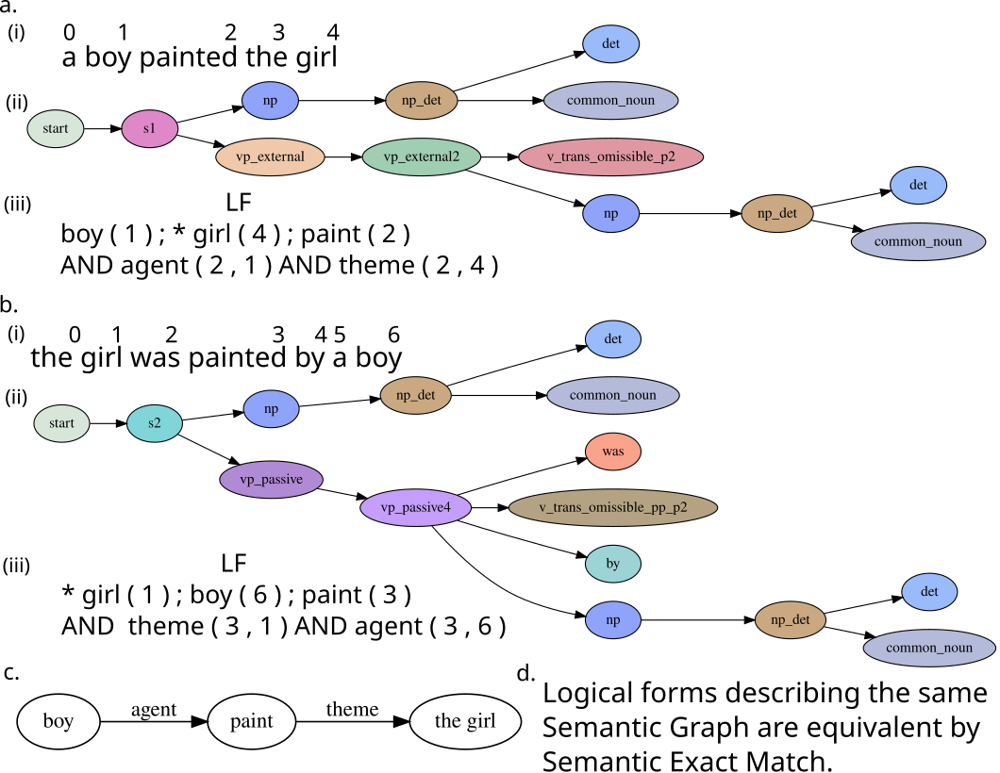
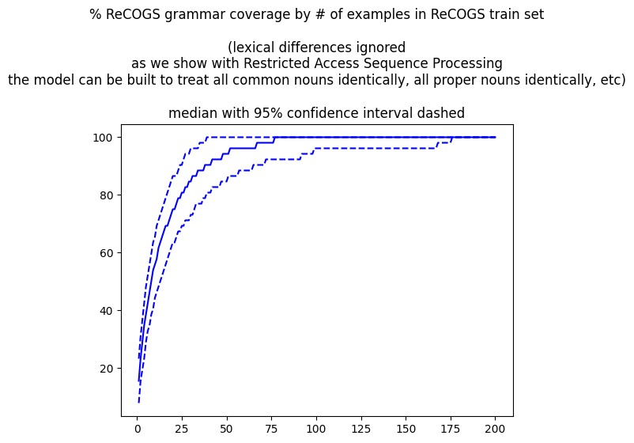
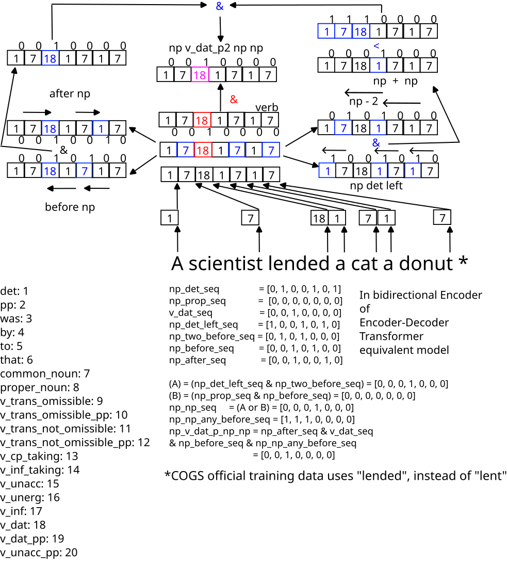
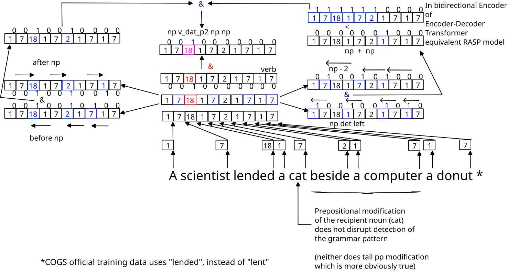
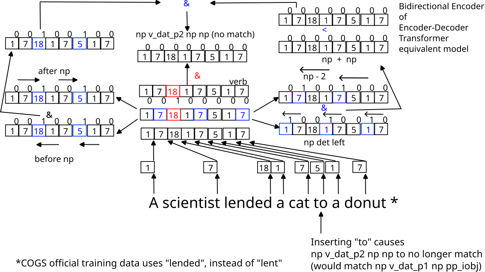

Solving little problems in Restricted Access Sequence Processing (RASP), a language designed to help one in "Thinking Like Transformers" (title of Weiss et al 2021 paper, https://arxiv.org/abs/2106.06981 ,  which introduced it). 

Used RASP for a final project in Stanford XCS224U class this year to solve ReCOGS_pos ( https://digitalcredential.stanford.edu/check/24288227F20DD8486799B5FF5E8C04CB440129EC0DE44FEB65C4BAFABDBAA68BQWtzR2p1TG45dHowNWg5dXp6UW1kNmdYVVExekNJa1V3R2J5aFdhWi9Lb01MakFZ ) so was trying to keep myself accountable by working through problems in a repo along the way. 

Programs in this folder can be interpreted using Weiss et al 2021's RASP interpreter at https://github.com/tech-srl/RASP .

Please cite this repository and/or the associated paper-in-progress at https://raw.githubusercontent.com/willy-b/RASP-for-ReCOGS/main/rasp-for-recogs_pos-wbruns-2024-draft.pdf if you use anything from here or find it helpful!

## RASP-for-ReCOGS_pos ( recogs_examples_in_rasp.py and word-level-pos-tokens-recogs-style-decoder-loop.rasp )

**Update: There is an associated unpublished research paper which is in early stages at https://raw.githubusercontent.com/willy-b/RASP-for-ReCOGS/main/rasp-for-recogs_pos-wbruns-2024-draft.pdf .**

**Copies of evaluation results notebooks and a comparison with Wu et al 2023 Transformer baselines trained from scratch are also checked in at https://github.com/willy-b/RASP-for-ReCOGS/tree/main/supplemental_data#analysis-and-evaluation-notebooks .**

This section describes a RASP model under development to perform the ReCOGS_pos task (see Wu et al 2023, "ReCOGS: How Incidental Details of a Logical Form Overshadow an Evaluation of Semantic Interpretation", https://arxiv.org/abs/2303.13716 for task description) to try to prove-by-construction that a Transformer can learn it in a compositional, systematic, length generalizing way and try to understand why some errors are observed.

You can run a demo and see the autoregressive output on the training set

(or just visit e.g. https://colab.research.google.com/drive/1q-24YGWYX2zo7N50q69Y8jg5Kcb_0ph4?usp=sharing for a full dev set evaluation )

```
git clone https://github.com/willy-b/learning-rasp.git
cd learning-rasp
python recogs_examples_in_rasp.py # runs only 5 examples on training set by default, you can run more examples or evaluate on dev/test/gen by using commandline arguments (see file)
```

The script will show performance on Wu et al 2023 ReCOGS_pos training data by default, run with "--use_dev_split", "--use_gen_split" , or "--use_test_split" to see it run on those and give a running score every row.



Figure 1 from  (vector graphics used in paper, raster above).
The task we solve is to extract the meaning (c) written in format (iii) of sentences (i). Full description of Figure (in higher quality vector graphics as well) is in the paper.

For ReCOGS, intending to perform well on Semantic Exact Match, we took a simple, flat, non-tree, non-recursive approach (we do NOT implement any tree/recursive combination rules across sequence positions like `np_det pp np -> np_pp -> np`) which was able to get 100% on the full test set first try: https://colab.research.google.com/drive/1N7F-nc9GVnoC_9dBVdNT02SBiBcMbgy-?usp=sharing .

We also report String Exact Match since https://github.com/willy-b/learning-rasp/pull/7 (Semantic Exact Match is more forgiving, ignoring reorderings of the logical form that do not change the semantics).

We took the RASP native sequence tokens, and first did a Transformer learned-embedding compatible operation and created 1 part-of-speech and 4 extra verb-type sequences (because each word in the COGS vocabulary may actually serve multiple POS roles; up to four different verb types as in the case of "liked" 

which can serve as v_trans_not_omissible, v_trans_not_omissible_pp_p1, v_trans_not_omissible_pp_p2, and v_cp_taking types). 

The five extra sequences serve to associate each word with one or more of the following part-of-speech/verb type roles:
```
det: 1
pp: 2
was: 3
by: 4
to: 5
that: 6
common_noun: 7
proper_noun: 8
v_trans_omissible: 9
v_trans_omissible_pp: 10
v_trans_not_omissible: 11
v_trans_not_omissible_pp: 12
v_cp_taking: 13
v_inf_taking: 14
v_unacc: 15
v_unerg: 16
v_inf: 17
v_dat: 18
v_dat_pp: 19
v_unacc_pp: 20
# v_normalized_in_output: 21 # only used in decoder loop
#, represents stemmed verbs where type is not important
```

For those used to multidimensional representations, one can think of these as one-hot vectors of dimension 20 (21 in the decoder) and replace equality checks with vector dot product (and a check for either common_noun or proper_noun would be a dot product with the sum of one-hot 20 dimensional vectors given by (common_noun + proper_noun)) but we keep it simple for human reading here and use these scalars in 1d as is easily supported by RASP.

Each of the five sequences comes from a separate map. Since in RASP modeling a Transformer, a map could only have a single value per key, and since individual words had up to four different verb roles (as in "liked" which had 4).

Upon these five parallel, aligned, sequences we used a series of attention head compatible operations to recognize multi-token patterns corresponding to 19 grammatical forms to cover the input grammar.

To justify this approach, we can, given the COGS input sentences were generated as a probablistic context free grammar per (Kim and Linzen 2020, https://aclanthology.org/2020.emnlp-main.731 )
use the full details put in Lark format by ( Klinger et al 2024 , https://arxiv.org/abs/2309.16467 just their utilities , not their model )
and convert it ourselves to a format compatible with ( Zeller et al 2023, https://www.fuzzingbook.org/html/GrammarCoverageFuzzer.html ) and use their TrackingGrammarCoverageFuzzer to generate the set of all expansions of the COGS grammar. 

Note that grammar coverage lets us consider after each training example what could possibly have been learned about the grammar.
For example, we can use this to see that by 55 examples of the ReCOGS training set (unshuffled, no augmentations) or 77 (median; 95% confidence interval, n=1000 random shuffles: 39 to 161) examples of the ReCOGS training set (shuffled, no augmentations), 100% grammar coverage is reached (lexical differences ignored) (we treat all words within a POS identically) (for description of grammer coverage see Zeller et al 2023, https://www.fuzzingbook.org/html/GrammarCoverageFuzzer.html ) (noting that if the model is not capable of learning certain expansions in the grammar such as `np_det pp np -> np_pp -> np`, as is actually true for our RASP model and we hypothesis for the Wu et al 2023 baseline Transformer it will need to see more variations to memorize individual cases instead):




This confirms that if one already knows parts of speech and verb types for words one needs much less data (note this is consistent with large pretrained Transformer language models being observed to have learned to represent part of speech at the earliest layers, (Tenney et al 2019, "BERT Rediscovers the Classical NLP Pipeline", https://arxiv.org/abs/1905.05950 ).

Thus, we can be more efficient than using the ReCOGS training set for our RASP model built by hand since our solution uses a manual embedding via a dictionary mapping words to part-of-speech and verb-type, that ensures all words within a part of speech are treated identically. In general, pre-training or using an embedding like GloVe (Pennington et al., 2014) could ensure this type of information was available in the embedding; when training from scratch for COGS/ReCOGS we expect the act of modeling the input sentences to be able to result in embeddings with part-of-speech and verb type information, to facilitate this one might consider also to adjust the training objective as discussed in (Ahuja et al., 2024; https://direct.mit.edu/tacl/article/doi/10.1162/tacl_a_00733/127877/Learning-Syntax-Without-Planting-Trees ) to explicitly predict the input sentences by treating the seq2seq problem as a language modeling problem for the input concatenated with output instead of as a seq2seq. We
are focused on ReCOGS (and COGS) structural generalizations (which Transformer models perform poorly on), not lexical generalizations in this paper (Transformers already known to perform relatively well), so do not study the learning of word level representations (embeddings) here, only how those words are combined once they are mapped
to their possible part-of-speech and possible verb-types.

We generated 21 sentences which cover 100\% of the COGS input grammar ( Zeller et al 2023, https://www.fuzzingbook.org/html/GrammarCoverageFuzzer.html ) under those constraints (under the context free grammar, tree based assumption which turns out to be incorrect just for prepositional phrases):

(note that if the prepositional phrase and sentential complement cases were added into one or two of 19 base grammar form examples only 19 total examples are actually needed, but we keep the recursive grammar parts separated for clarity here)

```
"the girl was painted", 
"a boy painted",
"a boy painted the girl",
"the girl was painted by a boy",
"a boy respected the girl", 
"the girl was respected",
"the girl was respected by a boy",
"the boy grew the flower",
"the flower was grown",
"the flower was grown by a boy",
"the scientist wanted to read",
"the guest smiled",
"the flower grew",
"ella sold a car to the customer",
"ella sold a customer a car",
"the customer was sold a car",
"the customer was sold a car by ella",
"the car was sold to the customer by ella",
"the car was sold to the customer",

# 2 examples for recursive grammar rules
# 1 prepositional phrase example
"a boy painted the girl in a house"
# 1 sentential complement example
"the girl noticed that a boy painted the girl"
```

which correspond to the following grammar patterns respectively

```
((det common)|proper) was v_trans_omissible_pp_p1
((det common)|proper) v_trans_omissible_p1
((det common)|proper) v_trans_omissible_p2 
  ((det common)|proper)
((det common)|proper) was v_trans_omissible_pp_p2 
  by ((det common)|proper)
((det common)|proper) v_trans_not_omissible 
  ((det common)|proper)
((det common)|proper) was v_trans_not_omissible_pp_p1
((det common)|proper) was v_trans_not_omissible_pp_p2 
  by ((det common)|proper)
((det common)|proper) v_unacc_p1 
  ((det common)|proper)
((det common)|proper) was v_unacc_pp_p1
((det common)|proper) was v_unacc_pp_p2
  by ((det common)|proper)
((det common)|proper) v_inf_taking to v_inf
((det common)|proper) v_unerg
((det common)|proper) v_unacc_p2
((det common)|proper) v_dat_p1 
  ((det common)|proper) to ((det common)|proper)
((det common)|proper) v_dat_p2 
  ((det common)|proper) ((det common)|proper)
((det common)|proper) was v_dat_pp_p3
  ((det common)|proper)
((det common)|proper) was v_dat_pp_p4
  ((det common)|proper) 
  by ((det common)|proper)
((det common)|proper) was v_dat_pp_p2 
  to ((det common)|proper) by ((det common)|proper)
((det common)|proper) was v_dat_pp_p1
  to ((det common)|proper)
# 2 examples for recursive grammar rules
# 1 prepositional phrase example
# (flat rule: mask out "pp ((det common)|proper)" 
#             except when outputting noun and nmod)
((det common)|proper) v_trans_omissible_p2 
  ((det common)|proper) pp ((det common)|proper)
# 1 sentential complement example
# (flat rule: mask out cp prefix except 
#  when outputting that part of LF)
((det common)|proper) v_cp_taking that 
  ((det common)|proper) 
  v_trans_omissible_p2 ((det common)|proper)
```

Corresponding training examples can also be associated to show these are within the training data (we show just 1 match for each):

(Note that our RASP model collapses "a" and "the" to "det" (coded as 1) so we do as well here.)

**RASP-for-ReCOGS grammar pattern example** | **Actual part-of-speech/verb-type sequence used in RASP model** | **COGS/ReCOGS input training example**
-------------------- | ------------------------------------------------- | -----------------------
the girl was painted | det common\_noun was v\_trans\_omissible\_pp\_p1  | The donut was studied . 
a boy painted | det common\_noun v\_trans\_omissible\_p1  | The captain ate . 
a boy painted the girl | det common\_noun v\_trans\_omissible\_p2 det common\_noun  | The sailor dusted a boy . 
the girl was painted by a boy | det common\_noun was v\_trans\_omissible\_pp\_p2 by det common\_noun  | A drink was eaten by a child . 
a boy respected the girl | det common\_noun v\_trans\_not\_omissible det common\_noun  | A girl liked the raisin . 
the girl was respected | det common\_noun was v\_trans\_not\_omissible\_pp\_p1  | The pen was helped . 
the girl was respected by a boy | det common\_noun was v\_trans\_not\_omissible\_pp\_p2 by det common\_noun  | A rose was helped by a dog . 
the boy grew the flower | det common\_noun v\_unacc\_p1 det common\_noun  | A cat disintegrated a girl . 
the flower was grown | det common\_noun was v\_unacc\_pp\_p1  | A box was inflated . 
the flower was grown by a boy | det common\_noun was v\_unacc\_pp\_p2 by det common\_noun  | The cake was frozen by the giraffe . 
the scientist wanted to read | det common\_noun v\_inf\_taking to v\_inf  | The girl needed to cook . 
the guest smiled | det common\_noun v\_unerg  | The sailor laughed . 
the flower grew | det common\_noun v\_unacc\_p2  | A cake rolled . 
ella sold a car to the customer | proper\_noun v\_dat\_p1 det common\_noun to det common\_noun  | Emma passed a cake to the girl . 
ella sold a customer a car | proper\_noun v\_dat\_p2 det common\_noun det common\_noun  | Liam forwarded the girl the donut . 
the customer was sold a car | det common\_noun was v\_dat\_pp\_p3 det common\_noun  | A girl was sold the cake . 
the customer was sold a car by ella | det common\_noun was v\_dat\_pp\_p4 det common\_noun by proper\_noun  | The girl was lended the balloon by Harper . 
the car was sold to the customer by ella | det common\_noun was v\_dat\_pp\_p2 to det common\_noun by proper\_noun  | The pen was offered to the girl by Emma . 
the car was sold to the customer | det common\_noun was v\_dat\_pp\_p1 to det common\_noun  | The melon was lended to a girl . 
**Prepositional phrase and sentential complement examples mentioned in paper** | **part-of-speech/verb-type sequence (used example for development)** | **COGS/ReCOGS input training example**
a boy painted the girl in a house | det common\_noun v\_trans\_omissible\_p2 det common\_noun pp det common\_noun | A frog ate a sweetcorn in a pile . 
the girl noticed that a boy painted the girl | det common\_noun v\_cp\_taking that det common\_noun v\_trans\_omissible\_p2 det common\_noun | A girl said that a crocodile ate the rose . 

(All but the last example are from the first 119 training examples. Ignoring lexical differences, full coverage of the grammar
occurs by training example 55 in the PCFG sense (see "Appendix: Computing Grammar Coverage" (9.10)) when read in order
but the specific sentences we used (one of multiple ways to cover the grammar) occur by example 119 in the order given in the
train.tsv file, except for the specific sentential complement example we gave by modifying one of our existing examples with a
sentential complement ("the girl noticed that a boy painted the girl") which does not have an exactly matching counterpart until
the 4,186th example (other equivalent-for-these-purposes sentential complement examples are demonstrated earlier, e.g. within
55 examples in default ordering). Note the prepositional phrase and sentential complement examples are not actually pattern
matched (the 19 pattern matches plus a general cp/pp rule are used) and so do not exist in the RASP code, but are just given for
reference.)

The first 19 of those sentences are present in our RASP program code ( https://github.com/willy-b/learning-rasp/blob/dca0bc6689b0454b75e5a46e77ffe66566ca7661/word-level-pos-tokens-recogs-style-decoder-loop.rasp#L568 ) as canonical examples of verb type templates.
For each of these sentences we add a group of RASP operations corresponding to attention operations in a Transformer to match a template corresponding to that sentence type. 

Those 19 examples reflect the only rules for handling non-prepositional grammar rules. 

To handle prepositional phrases in a flat solution, we find it necessary even on the training data to add a rule that ignores noun phrases preceded by a prepositonal phrase (ignore "pp np") when searching for noun indexes to report in relationships (agent, theme, recipient, etc), and we loosen verb type templates to allow a gap for any prepositional phrase to be inserted (this was not done in every possible case manually within the original 2 week project work period which is why we did not get 100% in that one split, see paper results section). We shall see encountering this issue in RASP and the grammar analysis suggesting a non-tree solution is learned by the Transformer appears to lead us to be able to predict 100% of a certain category of errors a baseline Wu et al 2023 ( https://arxiv.org/abs/2303.13716 ) Encoder-Decoder Transformer makes for most model instances (96% of errors overall) present in our RASP solution before adding the rule to ignore "pp np" (based on training examples but biased to learn it generally) (the RASP model got 100% on the ReCOGS_pos test set first try, see https://colab.research.google.com/drive/1N7F-nc9GVnoC_9dBVdNT02SBiBcMbgy-?usp=sharing , though you can use the python script in this folder to run that test yourself as well).


Here is an example of a template for one of these sentences:
```
np_det_mask = select(7, pos_tokens, ==) 
and select(pos_tokens, 1, ==) 
and select(indices+1, indices, ==);
np_prop_mask = select(8, pos_tokens, ==) and 
select(indices, indices, ==);
np_det_sequence = aggregate(np_det_mask, 1);
np_prop_sequence = aggregate(np_prop_mask, 1);
np_det_after = select(np_det_sequence, 1, ==) and 
select(indices+1, indices, ==);
np_prop_after = select(np_prop_sequence, 1, ==) and 
select(indices+1, indices, ==);
np_after_mask = np_det_after or np_prop_after;
np_after_sequence = aggregate(np_after_mask, 1);
np_after_mask = select(np_after_sequence, 1, ==) and 
select(indices,indices, ==);
# ...

# np v_unerg
# e.g. [1,7,16]
set example ["the", "guest", "smiled"]
v_unerg_mask = select(16, pos_tokens_vmap1, ==) and 
select(indices, indices, ==);
np_v_unerg = aggregate(np_after_mask and v_unerg_mask, 1);
```

Example RASP model flat grammar pattern matching case (np v_dat_p2 np np):



Example RASP model flat grammar pattern matching case despite pp modification of middle recipient noun (np v_dat_p2 np np):



Example RASP model same flat grammar pattern non-matching case:



**These patterns are not causal because their use/input/output is masked to the input section of the sequence, so would take part in the Encoder of the Encoder-Decoder only**(**all operations outside the input mask in the word-level token RASP solution used in this paper are directly or indirectly causally masked** and we built symbol by symbol in a causal autoregressive way). **We could have added an explicit causal mask to each operation but for efficiency and simplicity of the code omitted it when we are doing it implicitly by taking only the last sequence position (we also acausally aggregate so that all sequence positions have the same value as the last sequence position to make it easier to read the output -- RASP interpreter will just print it as one position if they are all equal and we only take one position).**

Also, the author thinks many of these RASP steps could be consolidated. The goal here was to first prove by construction that a non-recursive, flat RASP program could get approximately 100% Semantic Exact Match on all the ReCOGS generalization splits (we only missed 100% semantic exact match on one of the generalization splits, achieving 92%, and it is not a fundamental limitation of our approach, we achieved 100% string exact match on that same split in the separate RASP-for-COGS project which uses the same input grammar and is more difficult so believe it was an unlucky/human implementation mistake only).

Introduction of variables at the beginning of the ReCOGS logical form (e.g. in the logical form for "a boy painted the girl", we have "boy ( 1 ) ; * girl ( 4 ) ; paint ( 2 ) AND agent ( 2 , 1 ) AND theme ( 2 , 4 )" , the variable introduction is "boy ( 1 ) ; * girl ( 4 ) ; paint ( 2 )" before the "AND"). A more complete solution that handles not just prepositional phrase recursion (we score approximately 100% with the solution we are describing here). In the description here we ignore sentential complements / complement phrases (see code for those details) and simplify and just sort the input sequence with nouns before verbs and determiners, fillers last (with determiners and fillers not having any corresponding entry in the output sequence). We then count nouns and verbs in the input and count nouns and verbs in the output and determine if we have introduced all the nouns and verbs.

Example counting how many nouns and verbs we have output (introduced as variables) so far (to determine what we need to output for next token):
```
nv_in_output_sequence = 
OUTPUT_MASK*(indicator(pos_tokens == 7 or pos_tokens == 8) + 
indicator(pos_tokens_vmap1 == 9 or pos_tokens_vmap2 == 10 or 
pos_tokens_vmap1 == 11 or pos_tokens_vmap2 == 12 or pos_tokens_vmap3 == 13 or 
pos_tokens_vmap4 == 14 or pos_tokens_vmap1 == 15 or pos_tokens_vmap1 == 16 or 
pos_tokens_vmap1 == 17 or pos_tokens_vmap1 == 18 or pos_tokens_vmap2 == 19 or 
pos_tokens_vmap2 == 20 or pos_tokens_vmap1==21));
nv_in_output_count = selector_width(select(nv_in_output_sequence, 1, ==)); 
# causal operation as we use only last sequence position
```

How variables are introduced with their index (omitted sorting of input and other operations that can be read in the code and are less important; anything acausal is restricted to input sequence section (Encoder)):
(only value at last sequence position is used; causal)
```
# introducing variables
output = "";
# definite article word handling
before_target_word_index = aggregate(select(indices, nv_in_output_count, ==), input_indices_sorted)-1;
has_star = aggregate(select(indices, before_target_word_index, ==), tokens) == "the";
last_output_is_star = aggregate(select(indices, length-1, ==), tokens) == "*";
input_nv_sorted_by_type = input_tokens_sorted_by_type * (input_noun_mask_sorted + input_verb_mask_sorted);
target_word_token = aggregate(select(indices, nv_in_output_count, ==), normalize_nv(input_nv_sorted_by_type)) if (not has_star or last_output_is_star) else "*";
# subtract 1 when matching
# for producing the index
# because we just output the additional word by then
target_word_index = aggregate(select(indices, nv_in_output_count-1, ==), input_indices_sorted);
output = target_word_token if ((num_tokens_in_output_excluding_asterisks % 5) == 0) else output;
output = "(" if ((num_tokens_in_output_excluding_asterisks % 5) == 1) else output;
output = target_word_index if ((num_tokens_in_output_excluding_asterisks % 5) == 2) else output;
output = ")" if ((num_tokens_in_output_excluding_asterisks % 5) == 3) else output;
# note that
# when nv_in_output_count == nv_in_input_count,
# we will add AND instead of ";"
output = ( ";" if ( 5 * nv_in_input_count - 1 > num_tokens_in_output_excluding_asterisks ) else "AND" ) if (num_tokens_in_output_excluding_asterisks % 5 == 4) else output;
# if we didn’t have an input/output separator
# that needs to be output
output = "|" if num_pipes_in_output == 0 else output;
# note that the output/next token prediction above will be overridden
# with later decoder variables
# (e.g. verb relationship or noun modifier logical form tokens, see below)
# if noun/verb introduction is complete, that is if the decoder detects
# that all nouns/verbs in input have been output in the logical form.
```

Note that "normalize_nv" is a lookup into a map that has no effect unless the word is a verb in which case it normalizes it to a standard suffix ("ate" to "eat" , "painted" to "paint", etc).

As you can see above, if we have not introduced all the variables, we determine our index into the sorted list of nouns and verbs (nouns before verbs), and using a MLP modeling modulus, compute index mod 5 (alternatively, number of tokens since last separator) and condition on that to output that noun/verb or parentheses or index as prediction for next token at last sequence position (all other sequence positions are ignored). Since we do ReCOGS_pos (semantically identical to random indices but avoid requiring random numbers) the index we use is the index of the original noun or verb in the original sequence. If we are still introducing variables, that is the end and we have our prediction for the next token.

If we are done introducing variables at that point in the decoder loop, we move on, 
and attention head compatible operations recognize templates in the five parallel part-of-speech / verb-type per location sequences for "v_trans_omissible_p1", "v_trans_omissible_p2", "v_trans_omissible_pp_p1", "v_trans_omissible_pp_p2", "v_trans_not_omissible", "v_trans_not_omissible_pp_p1", "v_trans_not_omissible_pp_p2", "v_cp_taking", "v_inf_taking", "v_unacc_p1", "v_unacc_p2", "v_unacc_pp_p1", "v_unacc_pp_p2", "v_unerg", "v_dat_p2", "v_dat_pp_p1", "v_dat_pp_p2",  "v_dat_pp_p3",  "v_dat_pp_p4".

To be clear, we always compute all variables (noun and verb introduction, verb relationships, nmods) but depending on the number of nouns/verbs, verb relationships, nmods detected in
the output so far, variables from "completed" or "premature" phases are discarded and the next predicted token is given by variables associated with the appropriate phase, here the verb relationship phase.

Here are a couple of examples of patterns the Encoder recognizes, to see how it looks if we support 1 verb pattern per input (no sentential complement recursion; which can be easily handled how we handle other things we loop over, looping over current phrase and masking and processing), which is sufficient to get approximately 100% on all entries that do not use sentential complements (e.g. "the girl noticed that a boy painted" is not supported in this example but "a boy painted" is):

```
# define the pattern
# ... 
# (just showing one example,
# np_prop_mask and
# np_before_mask
# are attention masks defined earlier)
# np v_dat_p2 np np
# e.g. [8,18,1,7,1,7]
set example ["ella","sold","a","customer","a","car"]
np_np_sequence = aggregate((np_prop_mask and np_before_mask) or (np_det_left_mask and np_two_before_mask), 1);
# would not support prepositional phrase modification on middle NP
#np_np_before_mask = # select(np_np_sequence, 1, ==) and select(indices-1, indices, ==);
np_np_any_before_mask = select(np_np_sequence, 1, ==) and select(indices, indices, >);
# acausal is ok
# in INPUT sequence (encoder part, not decoder), # would mask further if we wanted to do multiple templates per input or
# something outside the supported grammar (COGS without sentential complement
# recursion is supported here)
np_np_any_before_sequence = aggregate(np_np_any_before_mask, 1);
np_np_any_before_mask = select(np_np_any_before_sequence, 1, ==) and select(indices, indices, ==);
np_v_dat_p_np_np = aggregate(np_after_mask and v_dat_mask and np_before_mask and np_np_any_before_mask, 1);
# Example: np_v_dat_p_np_np([’ella’, ’sold’, ’a’, ’customer’, ’a’, ’car’])  = [0, 1, 0, 0, 0, 0] (ints)
# Example: np_v_dat_p_np_np([8, 18, 1, 7, 1, 7]) = [0, 1, 0, 0, 0, 0] (ints)
# ...
# check the pattern and set the template name
any_np_v_trans_omissible = aggregate(select(np_v_trans_omissible, 1, ==), 1);
template_name = "v_trans_omissible_p1" if (any_np_v_trans_omissible == 1) else template_name;
# ...
any_v_dat_p2 = aggregate(select(np_v_dat_p_np_np, 1, ==), 1);
template_name = "v_dat_p2" if (any_v_dat_p2 == 1) else template_name;
# ...
any_v_dat_pp_p4 = aggregate(select(np_was_v_dat_pp_np_by_np, 1, ==), 1);
template_name = "v_dat_pp_p4" if (any_v_dat_pp_p4 == 1) else template_name;
# must be checked after P4
any_v_dat_pp_p2 = aggregate(select(np_was_v_dat_pp_to_np_by_np, 1, ==), 1);
template_name = "v_dat_pp_p2" if (any_v_dat_pp_p2 == 1) else template_name;
# template name is used to lookup
# the number of verb relationships to output
# and what they are for each index
# e.g. ["theme", "agent"]
# vs. ["agent", "recipient", "theme"] etc
```

The rest of this applies to just values used from the last sequence location (output is prediction for next symbol).

Based on the template recognized, we lookup the template size for number of relationships (theme, recipient, agent) for that verb type:
```
def template_size(template_name) {
  template_sizes = {
 "": 0,
 "v_trans_omissible_p1": 1,
 "v_trans_omissible_p2": 2,
 "v_trans_omissible_pp_p1": 1,
 "v_trans_omissible_pp_p2": 2,
 "v_trans_not_omissible": 2,
 "v_trans_not_omissible_pp_p1": 1,
 "v_trans_not_omissible_pp_p2": 2,
 "v_cp_taking": 2,
# (NOTE: comments within the map should be removed)
# v_inf_taking is a special 2-verb case, 5 items
# after noun introduction
# (verb 1, agent 1, xcomp verb 1 to verb 2, verb 2, agent 2)
# if when counting the first verb were included
# in introduction phase for v_inf,
# then it would be 4
# indeed the last map used is template_mapping4
 "v_inf_taking": 5,
# n.b. if we output out of order
# (as allowed by Semantic Exact Match)
# and put both verbs in beginning
# (verb 1, verb 2, agent 1, xcomp verb 1 to verb 2, agent 2)
# then the count would be 3
# as we could do normal combined noun and verb intro
# but if doing String Exact Match, ReCOGS LF has
# verb 2 after the xcomp for v_inf_taking
 "v_unacc_p1": 2,
 "v_unacc_p2": 1,
 "v_unacc_pp_p1": 1,
 "v_unacc_pp_p2": 2,
 "v_unerg": 1,
# "v_inf": 1,
 "v_dat_p1": 3,
 "v_dat_p2": 3,
 "v_dat_pp_p1": 2,
 "v_dat_pp_p2": 3,
 "v_dat_pp_p3": 2,
 "v_dat_pp_p4": 3 
  };
  # v_inf_taking includes v_inf and an extra verb is why it is 4 instead of 2 (counting after the intro incl first verb as in all other patterns)
  return template_sizes[template_name];
}
```

Details are in the code, but we compute at the last sequence position (in parallel) the number of relationships output for the verb so far, and for the current relationship which token within that multi-token process (e.g. the word "agent" or the open parenthesis "(" or the left index, or the comma, or right index, close parenthesis ")", "AND", etc) we are on.

Like we computed at the last sequence position the number of nouns and verbs in the output once we are finished introducing nouns and verbs (this would be a little different with sentential complements (see actual code for CP support)), we compute the number of agent,theme,recipient,xcomp entries in the output:
```
atrx_in_output_sequence = OUTPUT_MASK*(indicator(tokens == "agent" or tokens == "theme" or tokens=="recipient" or tokens=="xcomp"));
# agent_theme_recipient_xcomp_output_count is the number of relationships we have output
agent_theme_recipient_xcomp_output_count = selector_width(select(atrx_in_output_sequence, 1, ==));
after_intro_idx = (nv_in_output_count - nv_in_input_count + (1 if any_v_inf_taking == 1 else 0) + agent_theme_recipient_xcomp_output_count) if nv_in_output_count + (1 if any_v_inf_taking == 1 else 0) >= nv_in_input_count else 0;
```

We use all those different values which are computed independently from the input sequence and so do not add depth/layer requirements as many of the ones which involve accessing the sequence can be done in parallel. 
We then use the verb-type and relationship index to the relationship into a map to get the current relationship to output (as some verb types output agent first, some output theme, etc):
```
template_mapping1 = {
"": "",
"v_trans_omissible_p1": "agent",
"v_trans_omissible_p2": "agent",
"v_trans_omissible_pp_p1": "theme",
"v_trans_omissible_pp_p2": "theme",
"v_trans_not_omissible": "agent",
"v_trans_not_omissible_pp_p1": "theme",
"v_trans_not_omissible_pp_p2": "theme",
"v_cp_taking": "agent",
"v_inf_taking": "agent",
"v_unacc_p1": "agent",
"v_unacc_p2": "theme",
"v_unacc_pp_p1": "theme",
"v_unacc_pp_p2": "theme",
"v_unerg": "agent",
"v_inf": "agent",
"v_dat_p1": "agent",
"v_dat_p2": "agent",
"v_dat_pp_p1": "theme",
"v_dat_pp_p2": "theme",
"v_dat_pp_p3": "recipient",
"v_dat_pp_p4": "recipient"
};
```

Outputting the verb relationships we must skip over any "pp np" as possible agents, themes, or recipients to avoid getting confused by noun phrases added by prepositional modification (believed by the author to be a cause of the issue with obj pp to subj pp generalization by (Wu et al 2023 https://arxiv.org/abs/2303.13716 )'s Transformer).

(the `\` followed by newlines should be removed before use, they are to help in reading)
```
pp_sequence = indicator(pos_tokens == 2);
pp_one_after_mask = select(pp_sequence, 1, ==) and \
  select(indices+1, indices, ==);
pp_one_after_sequence = aggregate(pp_one_after_mask, 1);
pp_one_after_mask = select(pp_one_after_sequence, 1, ==) and \
  select(indices, indices, ==);

pp_two_after_mask = select(pp_sequence, 1, ==) and \
  select(indices+2, indices, ==);
pp_two_after_sequence = aggregate(pp_two_after_mask, 1);
pp_two_after_mask = select(pp_two_after_sequence, 1, ==) and \
  select(indices, indices, ==);

np_det_diag_mask = select(aggregate(np_det_mask, 1), 1, ==) and \
  select(indices, indices, ==);
np_prop_diag_mask = select(aggregate(np_prop_mask, 1), 1, ==) and \
  select(indices, indices, ==);

no_pp_np_mask = \
1 - aggregate((pp_one_after_mask and np_prop_diag_mask) or \
(pp_two_after_mask and np_det_diag_mask), 1);

# here we compute left_idx and right_idx
# for verb relationships, like "agent ( [left_idx] , [right_idx] )"

# one-based index
nps_without_pp_prefix_indices = \
selector_width(select(NOUN_MASK*no_pp_np_mask, 1, ==) and \
select(indices, indices, <=))*NOUN_MASK*no_pp_np_mask;

# the one verb (except v_inf_taking cases)
left_idx_in_nvs_zero_based = nv_in_input_count-1;
# (after sentential complements, not covered in this example, see actual code via link above)
# need to also subtract the index in ReCOGS for the 2nd verb if it is v_inf_taking
left_idx_in_nvs_zero_based = (left_idx_in_nvs_zero_based-1) \
  if (template_name == "v_inf_taking" and after_intro_idx <= 2) else left_idx_in_nvs_zero_based;
left_idx = aggregate(select(indices, left_idx_in_nvs_zero_based, ==), input_indices_sorted);

# avoids attractor nouns
right_idx = aggregate(select(nps_without_pp_prefix_indices, after_intro_idx, ==), indices);

# points to 2nd verb for xcomp for v_inf_taking_v_inf
# note, this simplified example ignores sentential complement (CP) handling
# (ideally this would be verb specific,
#  we simplify here to reuse variables available in this example)
right_idx = aggregate(select(indices, nv_in_output_count, ==), input_indices_sorted) \
   if (template_name == "v_inf_taking" and after_intro_idx == 2) else right_idx;

# points to 1st noun for 2nd v_inf agent in v_inf_taking_v_inf
right_idx = \
  aggregate(select(nps_without_pp_prefix_indices, 1, ==), indices) \
  if (template_name == "v_inf_taking" and after_intro_idx == 4) else right_idx;

# we have computed left_idx and right_idx
# for verb relationships, like "agent ( [left_idx] , [right_idx] )"

# ...

# note, the offset since the last separator in the output,
# instead of a modulus, could have been used here
# see actual RASP file in GitHub for computation

# relationship ( idx , idx ) AND
#      0       1  2  3  4  5  6
after_intro_target_token = "";

# "agent", "theme", "recipient", etc 
# depending on relationship index and flat-matched template (in Encoder)
template_mapping_output = \
  get_template_mapping(template_name, after_intro_idx);

# see code in Github for definition of 
# after_intro_num_tokens_in_output_excluding_asterisks
# and use of an offset that depends on v_inf or not
# out of scope for this simplified example
after_intro_target_token = template_mapping_output \
  if ((after_intro_num_tokens_in_output_excluding_asterisks) % 7 == 0) \
  else after_intro_target_token;

after_intro_target_token = "(" \
  if ((after_intro_num_tokens_in_output_excluding_asterisks) % 7 == 1) \
  else after_intro_target_token;

after_intro_target_token = left_idx \
if (after_intro_num_tokens_in_output_excluding_asterisks % 7 == 2) \
else after_intro_target_token;

after_intro_target_token = "," \
if (after_intro_num_tokens_in_output_excluding_asterisks % 7 == 3) \
else after_intro_target_token;

after_intro_target_token = right_idx \
if (after_intro_num_tokens_in_output_excluding_asterisks % 7 == 4) \
else after_intro_target_token;

after_intro_target_token = ")" \
if (after_intro_num_tokens_in_output_excluding_asterisks % 7 == 5) \
else after_intro_target_token;

after_intro_target_token = "AND" \
if \
(after_intro_num_tokens_in_output_excluding_asterisks % 7 == 6 \
and \
not (template_mapping_output == "")) \
else after_intro_target_token;

# ...

# the next token predicted ("output") is
# overridden with after_intro_target_token
# ONLY if the decoder detects that verb relationships 
# are the appropriate output phase
# by counting how many nouns/verbs/relationships are already in the output
```
After outputting all verb relationships, we consider whether we have prepositional phrase noun modifiers to record in the logical form.

That is to say, if the current output sequence already includes the verb relationships expected for the input (the count matches), then those Decoder variables discussed earlier for verb relationships are still computed, but discarded, and the next token predicted will be overridden with a prepositional phrase noun modifier related output given by a RASP path similar to that below.

For outputting prepositional relationships ("nmod . in", "nmod . on", "nmod . beside"), we do a similar approach, counting prepositional phrases in the input, counting how many nmods we have output, figuring out which one is currently being output:

```
pps_in_input_sequence = INPUT_MASK*(indicator(pos_tokens == 2));
pps_in_input_count = selector_width(select(pps_in_input_sequence, 1, ==));
pps_index = pps_in_input_sequence*selector_width(select(pps_in_input_sequence,and select(indices,indices, <=));
nmods_and_pps_in_output_sequence = \
OUTPUT_MASK*(indicator(tokens == "nmod . in" or tokens == "nmod . beside" or tokens=="nmodnmods_and_pps_in_output_count = \
selector_width(select(nmods_and_pps_in_output_sequence, 1, ==));
nmods_and_pps_in_output_count = \
selector_width(select(nmods_and_pps_in_output_sequence, 1, ==));
current_pp = \
aggregate(select(pps_index, nmods_and_pps_in_output_count+1, ==), tokens) \
if pps_in_input_count > 0 else "";
current_pp = "" if current_pp == 0 else current_pp;
current_nmod_token = \
("nmod . " + current_pp) if (pps_in_input_count > 0 and not (current_pp == 0) \
and after_intro_num_tokens_in_output_excluding_asterisks % 7 == 0) else "";
current_nmod_token = \
"(" if after_intro_num_tokens_in_output_excluding_asterisks % 7 == 1 else current_nmod_token;
current_nmod_token = \
(aggregate(select(pps_index, nmods_and_pps_in_output_count, ==), indices)-1) if pps_in_input_count > 0 \
and after_intro_num_tokens_in_output_excluding_asterisks % 7 == 2 else current_nmod_token;
current_nmod_token = "," \
if after_intro_num_tokens_in_output_excluding_asterisks % 7 == 3 else current_nmod_token;
after_nmod_idx = \
aggregate(select(pps_index, nmods_and_pps_in_output_count, ==), indices)+1;
token_at_after_nmod_idx = \
aggregate(select(indices, after_nmod_idx, ==), tokens);
after_nmod_idx = \
(after_nmod_idx + 1) \
if (token_at_after_nmod_idx == "the" or token_at_after_nmod_idx == "a") else after_nmod_idx;
current_nmod_token = (after_nmod_idx) \
if pps_in_input_count > 0 \
and after_intro_num_tokens_in_output_excluding_asterisks % 7 == 4 else current_nmod_token;
current_nmod_token = ")" \
if after_intro_num_tokens_in_output_excluding_asterisks % 7 == 5 \
else current_nmod_token;
current_nmod_token = \
("AND" if nmods_and_pps_in_output_count < pps_in_input_count else "") \
if after_intro_num_tokens_in_output_excluding_asterisks % 7 == 6 \
else current_nmod_token;
after_intro_and_relationships_nmod_token = \
current_nmod_token if nmods_and_pps_in_output_count <= pps_in_input_count else "";
num_tokens_in_nmod_section = \
after_intro_num_tokens_in_output_excluding_asterisks - template_size(template_name)*7 + 1;
# the decision of whether the nmod output dominates the current decoder next predicted token
# is computed similarly to the following (see GitHub for actual)
# we have not included the computation of "offset" and "after_intro_num_tokens_in_output_excluding_asterisks"
output = after_intro_and_relationships_nmod_token \
if (template_mapping_output == "" and \
after_intro_num_tokens_in_output_excluding_asterisks >= \
template_size(template_name)*7+offset - 1 and \
num_tokens_in_nmod_section < 7*pps_in_input_count and pps_in_input_count > 0 \
) else output;

# the decision of whether the nmod output dominates the current decoder next predicted token
# is computed similarly to the following (see GitHub for actual)
# we have not included the computation of "offset" and "after_intro_num_tokens_in_output_excluding_asterisks"
output = after_intro_and_relationships_nmod_token \
if (template_mapping_output == "" and \
after_intro_num_tokens_in_output_excluding_asterisks >= \
template_size(template_name)*7+offset - 1 and \
num_tokens_in_nmod_section < 7*pps_in_input_count and pps_in_input_count > 0 \
) else output;
```

See code for full details (for simplicity this description was also written without discussing sentential complement handling). For all steps only the RASP outputs aligned with the input sequence (Encoder part of derived Transformer) or the very last sequence output (for next token in autoregressive generation) were used. For convenience of reading the aggregate operator was usually used acausally to assign all sequence outputs before the last one to the same value as the last (so only one value would be displayed).

You can run a demo and see the autoregressive output on the training set

(or just visit e.g. https://colab.research.google.com/drive/1q-24YGWYX2zo7N50q69Y8jg5Kcb_0ph4?usp=sharing for a full dev set evaluation )

```
git clone https://github.com/willy-b/learning-rasp.git
cd learning-rasp
python recogs_examples_in_rasp.py # runs only 5 examples on training set by default, you can run more examples or evaluate on dev/test/gen by using commandline arguments (see file)
```

## RASP-for-COGS

**NEW** The original, harder COGS task is now also solved in RASP in a separate project, see https://github.com/willy-b/RASP-for-COGS !
